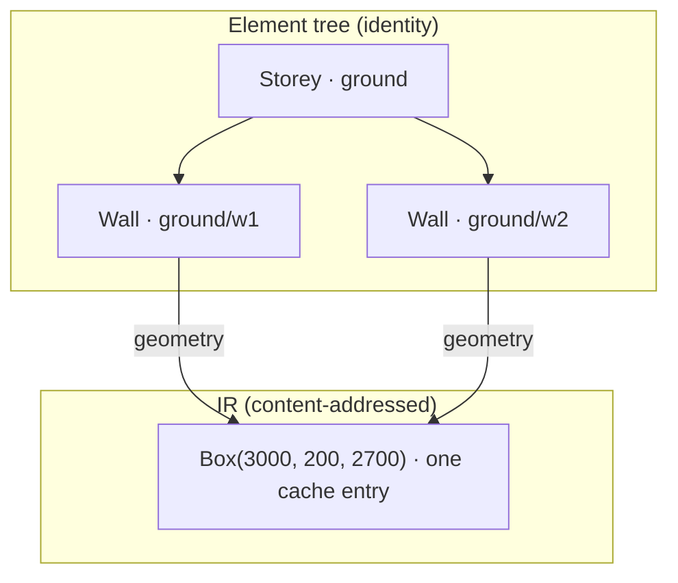

# Elements, Key Paths & Identity

The [CSG IR](/concepts/csg-ir) answers "have I built this shape before?" by hashing structure. Identity asks the opposite question: "is this _that_ wall?", and the answer must survive reordering siblings, editing dimensions, and rebuilding from scratch. This page is the model families uses to answer both questions at once without letting either contaminate the other.

## Two identical walls, one materialization

<!-- @run-test -->

```typescript
import { family, el, resolve, evaluateModel, type Element } from 'brepjs-families';
import { csg } from 'brepjs';

const Wall = family<{ readonly length: number }>('Wall', (p) =>
  el('Box', { size: [p.length, 200, 2700] })
);
const Storey = family<{ readonly walls: readonly Element[] }>('Storey', (p) =>
  el('Group', {}, p.walls)
);

const storey = resolve(
  Storey({
    key: 'ground',
    walls: [Wall({ key: 'w1', length: 3000 }), Wall({ key: 'w2', length: 3000 })],
  })
);

using ev = new csg.Evaluator();
evaluateModel(storey, ev);
console.log(ev.cacheStats().entries); // 1
```

One cache entry for two walls. Both elements exist, both have key paths, and if you opt into shapes (`{ shapes: true }`) both records hold the **same kernel handle**. The cache key contains zero identity fragments; the element tree contains zero geometry. That separation is the entire design:



## Key paths are the identity axis

Every resolved element's `keyPath` is its ancestor chain of keys joined with `/`: `ground/w1`. The path is what downstream consumers derive durable identifiers from; in the [IFC projection](/families/ifc-export) it becomes the seed of a deterministic GlobalId, which is why the same wall keeps the same GlobalId across rebuilds and across reordering its siblings.

Three rules keep paths sound:

- **Duplicate sibling keys throw** at resolution. Two children named `w1` under one parent would be one identity claimed twice.
- **`:` is reserved.** Synthesized segments (below) use it, so a user key can never collide with a generated path.
- **Unkeyed elements get an index fallback** (`Wall[0]`) for addressing, and the resolved element records `keyed: false`. Fallback paths are order-dependent by construction, which leads to the most important rule in the system:

> An element without an explicit key can render, resolve, and evaluate, but it can never mint durable identity. `familiesToBim` rejects unkeyed storeys, walls, slabs, and opening slots with a `Result` error rather than derive a GlobalId that silently changes when you reorder an array.

This is deliberately stricter than "only error when properties are present". A GlobalId derived from `Wall[0]` _works_ until the day someone inserts a wall in front of it, and then every downstream system sees a deleted wall and a new one. Refusing early is the honest contract.

## What resolution produces

`resolve()` runs render functions top-down and returns a `ResolvedElement` tree:

```typescript
interface ResolvedElement {
  readonly type: string; // 'Wall', 'Storey', 'Opening', ...
  readonly keyPath: string; // 'ground/w1'
  readonly keyed: boolean; // explicit key on this element?
  readonly geometry: csg.IRNode; // the content-addressed recipe
  readonly props: Readonly<Record<string, unknown>>; // pre-desugared invocation props
  readonly attributes: Readonly<Record<string, unknown>>; // psets, material, classification
  readonly relationships: readonly Relationship[]; // Contains / Voids / Fills
  readonly children: readonly ResolvedElement[];
}
```

Two fields deserve emphasis:

- **`props` are the invocation props, pre-desugaring.** An adapter that needs parameters (IFC's extruded-solid path cannot recover `length` from baked geometry) reads them here, exactly as the author wrote them, after any [schema validation](/families/props-and-validation) applied defaults.
- **`attributes` are captured, not rendered.** `psets`, `material`, and `classification` props are lifted off the element before render, so identity-side data structurally cannot reach the geometry hash.

## Synthesized openings

When a **fill-role** family (a door, a window) appears in a host's `voids`, resolution synthesizes an `Opening` element between host and filler:

```
ground/w1                    the wall        Voids -> ground/w1/voids:entry
ground/w1/voids:entry        the opening     Fills -> ground/w1/voids:entry/fill
ground/w1/voids:entry/fill   the door
```

The opening adopts the void slot's identity: it belongs to the _host's_ slot, so it survives the host being relocated and inherits the slot key's `keyed` state. Plain (non-fill) voids stay anonymous: a cut with no identity and no relationships, which is exactly right for a construction hole nobody needs to track.

## Where each concern lives

| Question                        | Answered by                                |
| ------------------------------- | ------------------------------------------ |
| Have I built this shape before? | `structuralHash` on the IR node            |
| Is this that wall?              | `keyPath` on the resolved element          |
| What are its properties?        | `props` / `attributes` beside the geometry |
| What does it contain or cut?    | `relationships` derived at resolution      |
| May it carry durable identity?  | `keyed` (explicit key required)            |

If you find yourself wanting geometry to depend on identity, or identity to depend on evaluation order, the model is telling you the design has the dependency backwards.

## Next steps

- **[Your First Building](/families/first-building)**: the walkthrough that exercises everything above.
- **[Why a Family Layer](/families/overview)**: the shorter framing, plus the copy-in distribution boundary.
