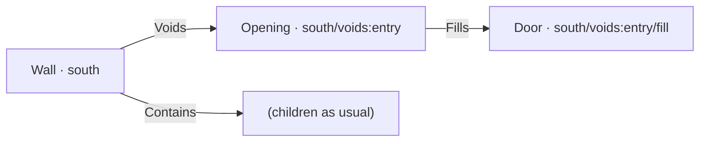

# Openings & Voids

A hole in a wall is two different things depending on who is asking. To the geometry kernel it is a boolean cut, done and forgotten. To a building model it is an **opening**: an element with identity, related to the wall it voids and the door that fills it. Families keeps both meanings, and the `role` of the voiding element decides which one you get.

## Plain voids: geometry only

Any element placed in a host's `voids` becomes a cut tool:

<!-- @setup -->

```typescript
import { family, el, tTranslate, type Element } from 'brepjs-families';

const Wall = family<{ readonly length: number }>('Wall', (p) =>
  el('Box', {
    size: [p.length, 200, 2700],
    voids: [
      // An anonymous service penetration: cut it, track nothing.
      el('Box', { size: [200, 300, 200], transform: [tTranslate([500, -50, 2200])] }),
    ],
  })
);
```

The tool is projected to IR, cut from the host, and that is the end of it: no key path, no relationships, nothing for an export to see. This is the right shape for holes nobody manages: penetrations, chamfers, sculpting cuts. Tools may overshoot their host freely (the 300 mm depth against a 200 mm wall above); only the intersection is removed.

## Fill-role voids: an Opening is synthesized

Declare a family with `role: 'fill'` and place an _instance of it_ in `voids`, and resolution builds more than a cut:

<!-- @setup -->

```typescript
const Door = family<{
  readonly width: number;
  readonly height: number;
  readonly at: readonly [number, number];
}>(
  'Door',
  (p) =>
    el('Box', {
      size: [p.width, 300, p.height],
      transform: [tTranslate([p.at[0], 0, p.at[1]])],
    }),
  { role: 'fill' }
);

const VoidedWall = family<{ readonly voids: readonly Element[] }>('Wall', (p) =>
  el('Box', { size: [4000, 200, 2700], voids: p.voids })
);

const wall = VoidedWall({
  key: 'south',
  voids: [Door({ key: 'entry', width: 1000, height: 2100, at: [1500, 0] })],
});
```

Resolution synthesizes an `Opening` element between host and filler, with the full relationship triangle:



- The **opening adopts the void slot's identity**: its path is `south/voids:entry`, built from the _host's_ slot, so it survives the host being moved or renamed elsewhere in the tree. The `:` in the segment is reserved, which makes synthesized paths structurally collision-free against any child key you could write.
- The **filler sits at `/fill`** under the opening and keeps its own props: `width`, `height`, materials, ratings.
- Slot keys follow the same rules as child keys: explicit key if given, index fallback if not, duplicates throw, and an unkeyed slot marks the opening `keyed: false`, which an [IFC export](/families/ifc-export) will refuse.

## Transforms carry openings

Desugaring order is voids first, then `fuse`, then the host `transform`. Openings and fills are cut in the host's **local frame** and then carried by the host's transform, so this wall and its doorway move as one:

<!-- @run-test -->

```typescript
const MovedWall = family<{ readonly voids: readonly Element[] }>('Wall', (p) =>
  el('Box', {
    size: [4000, 200, 2700],
    voids: p.voids,
    transform: [tTranslate([12000, 0, 0])],
  })
);

const moved = MovedWall({
  key: 'south',
  voids: [Door({ key: 'entry', width: 1000, height: 2100, at: [1500, 0] })],
});
// The door's world position is 12000 + 1500 along X. Its identity is unchanged.
```

Position is geometry; the key path is identity. Relocating a host changes where the opening _is_, never _which opening it is_.

## Orientation on rotated hosts

Walls that run along Y instead of X orient their box accordingly, and their fills do the same (the registry's starter `door` and `window` take an `alongY` flag for exactly this). At export time, the along-wall offset is recovered by projecting the void's frame onto the wall's axis, so a door 1.5 m along a Y-running wall lands 1.5 m along it in IFC too, and a door that would overhang the wall's end fails wall-bounds validation instead of silently clipping.

## What this buys downstream

The synthesized triangle is precisely what IFC wants: `IfcOpeningElement` related to the wall via `IfcRelVoidsElement`, filled via `IfcRelFillsElement`. Because the identity existed from resolution onward, the [export](/families/ifc-export) derives all three GlobalIds from key paths, and a reordered `voids` array with explicit slot keys changes nothing in the file.

## Next steps

- **[IFC Export](/families/ifc-export)**: the full projection, including containment rules and the validated sample building.
- **[Props & Validation](/families/props-and-validation)**: schema-checking fill props like widths and sills before they reach geometry.
